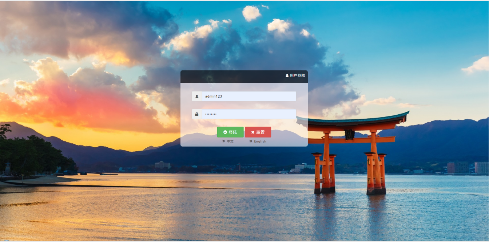

<h1 align="center"><a href="https://github.com/Fatezhang/scaffold-cloud" target="_blank">scaffold-cloud</a></h1>
<p align="center">一个适用于开发学习的Spring-cloud项目脚手架，技术栈包括但不限于spring-boot,mybatis,pagehelper,flyway-db,mybatis-genarator,eureka,spring-cloud,feign,ribbon,redis,rocketmq,ali-oss,TX-LCN分布式事务... ...</p>

<p align="center">
  <a href="https://buildkite.com/zhang/scaffold-cloud"></a>
  <a href="http://zhangjiaheng.cn"></a>
  <a href="https://www.oracle.com/technetwork/java/javase/downloads/index.html"></a>
  <a href="https://docs.spring.io/spring-boot/docs/2.0.3.RELEASE/reference/html/"></a>
  <a href="https://docs.spring.io/spring-boot/docs/2.0.3.RELEASE/reference/html/"></a>
  <a href="https://github.com/Fatezhang/scaffold-cloud/blob/master/LICENSE"></a>  
  <a href="https://gitter.im/scaffold-cloud/community?utm_source=badge&utm_medium=badge&utm_campaign=pr-badge"></a>  
</p>


<p align="center">
  <a href="https://github.com/Fatezhang/scaffold-cloud/stargazers"></a>
  <a href="https://github.com/Fatezhang/scaffold-cloud/network/members"></a>
  <a href="https://github.com/Fatezhang/scaffold-cloud/watchers"></a>
  <a href='https://gitee.com/chennianfenglou/scaffold-cloud/stargazers'></a>
</p>

## scaffold-cloud项目说明


### 快速开始
#### 本地启动

- 下载/克隆项目到本地 

    ```java
    git clone https://github.com/Fatezhang/scaffold-cloud
    ```
- 安装MySql数据库并启动
- 创建数据库scaffold_cloud_base，建议设置字符集为UTF-8
- 修改scaffold-business中微服务的数据库链接配置，本地运行只需要修改application-local.yml
- 安装redis服务并启动，修改scaffold-core-code配置文件中的配置，同样只需要修改local中的
- 安装Rocket MQ服务，同样修改配置
- 如果有需要，注册阿里OSS，并修改配置中的配置
- 启动EurekaApplication注册中心
- 启动TxlcnApplication分布式事务协调服务
- 启动SysServiceApplication，加载数据库字典等配置到缓存、提供后台管理微服务（权限、操作员、角色、国际化配置等）
- 启动RouteOperateApplication服务，默认端口为8750
- 访问http://localhost:8750/operate
- 默认账号密码为admin/admin123

#### docker 启动 (Linux 或者 Mac 下使用如下脚本 Windows 环境自行按照脚本中的示例执行 `mvn clean package docker:build -Pdocker`)

    1. 进入项目所在目录
    2. 执行 `./.scripts/recreate-docker-image.sh` 创建 docker 镜像
    3. 执行 `./.scripts/start-docker-service.sh` 即使用 docker-compose 启动
    
## scaffold-cloud 项目结构：
- scaffold-business [业务服务提供者](#) 端口从8850 - 8860
    - scaffold-business-sys-service [系统业务微服务-业务模块](#) 端口 8850
    - scaffold-business-job-service [定时任务微服务-业务模块](#) 端口 8851
    - scaffold-business-thirdparty-service [第三方业务微服务-业务模块](#) 端口 8852
- scaffold-business-api [业务API包 用于接口与实现分离](#)
    - scaffold-business-sys-api [系统资源、菜单、权限等API封装](#)
    - scaffold-business-job-api [定时任务API封装](#)
    - scaffold-business-thirdparty-api [第三方服务API封装](#)
- scaffold-core [工具类以及各种公共代码](#)
    - scaffold-core-code [每个模块都会用到的公共代码，Bean，config等](#)
    - scaffold-core-common [工具类模块，公共代码](#)
    - scaffold-core-plugin [自动代码生成插件模块](#)
- scaffold-eureka [注册中心Eureka](#) 端口 8761 - 8771
- scaffold-zuul [网关服务](#) 端口 8861 - 8870
- scaffold-config-server [配置服务端服务](#) 端口 8871 - 8881
- scaffold-config-client [配置客户端服务](#) 端口 8880 - 8891
- scaffold-tx-manager [分布式事务协调服务](#) 端口7970 
- scaffold-feign [Feign模块](#)
    - scaffold-feign-sys [feign-sys模块](#)
    - scaffold-feign-job [feign-job模块](#)
    - scaffold-feign-thirdparty [feign-thirdparty模块](#)
- scaffold-route [主业务消费者](#) 端口从8750 - 8760
    - scaffold-route-operate [后台管理接口及页面](#) 端口 8750
    - scaffold-route-app [APP客户端接口](#) 端口 8751
